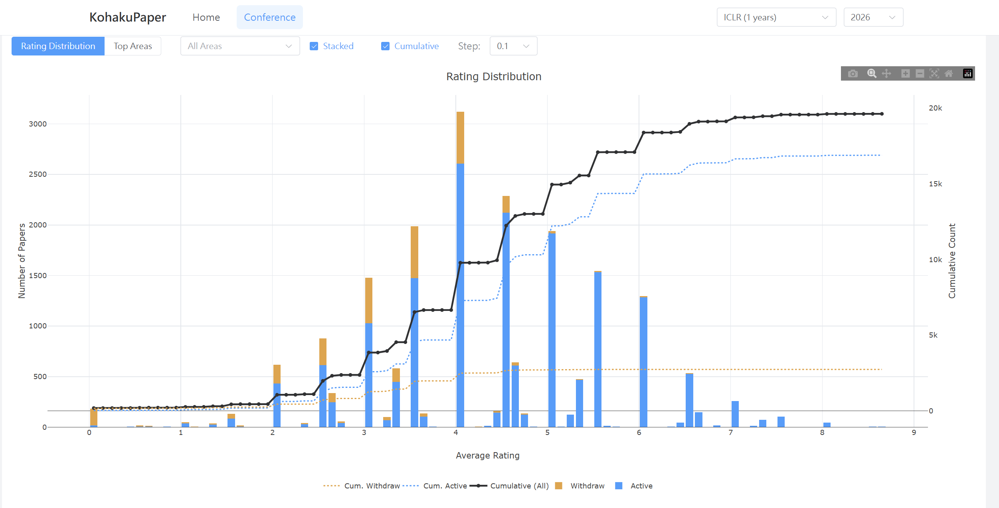
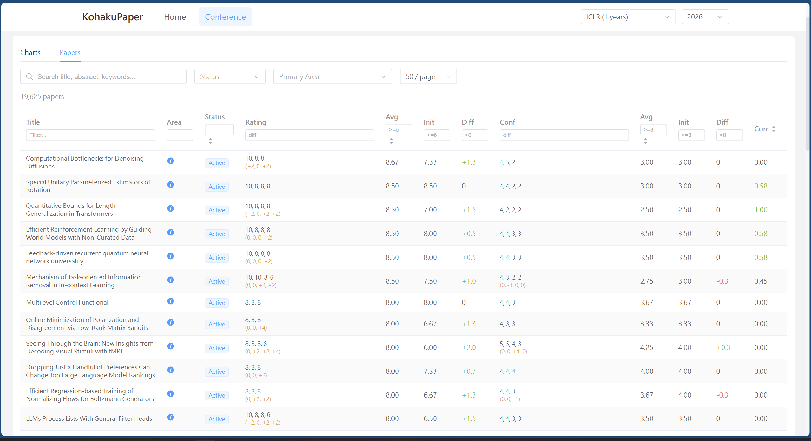

# KohakuPaper

A local paper copilot instance for fast and efficient statistics on AI conference papers. This project provides a Python backend API and Vue 3 frontend for browsing, querying, and analyzing academic paper data from major AI conferences.

|||
|-|-|

## Features

- **Fast Query Engine**: Uses DuckDB to query JSON paper data directly without importing to a database
- **Multi-Conference Support**: Supports 27+ conferences including ICLR, NeurIPS, ICML, CVPR, ACL, and more
- **Rating Diff Tracking**: Tracks paper score changes over time using git history
- **Rich Statistics**: Get statistics by status, area, track, rating distribution, and yearly trends
- **REST API**: Full-featured FastAPI backend with filtering, pagination, and sorting
- **Modern Frontend**: Vue 3 + Element Plus UI with interactive charts (Plotly.js)

## Supported Conferences

| Category | Conferences |
|----------|-------------|
| Machine Learning | ICLR, NeurIPS, ICML, AAAI, IJCAI, AISTATS, COLT, UAI, AutoML |
| Computer Vision | CVPR, ICCV, ECCV, WACV, 3DV |
| Graphics | SIGGRAPH, SIGGRAPH Asia |
| NLP | EMNLP, ACL, NAACL, COLING, COLM |
| Robotics | ICRA, IROS, CoRL, RSS |
| Others | KDD, ACM MM, WWW |

## Installation

### Requirements

- Python 3.10+
- Node.js 18+ (for frontend)
- Git (for sync with diff tracking)

### Backend Setup

```bash
# Clone the repository
git clone https://github.com/KohakuBlueleaf/KohakuPaperCopilot.git
cd KohakuPaperCopilot

# Create virtual environment
python -m venv .venv
source .venv/bin/activate  # On Windows: .venv\Scripts\activate

# Install package
pip install -e .
```

### Frontend Setup

```bash
cd src/kohaku-paper-web
npm install
```

## Quick Start

### 1. Start the Backend Server

```bash
kohakupaper serve
```

The API server will start at `http://127.0.0.1:48890`.

Options:
- `--host HOST`: Bind to specific host (default: 127.0.0.1)
- `--port PORT`: Bind to specific port (default: 48890)
- `--reload`: Enable auto-reload for development

### 2. Start the Frontend (Development)

```bash
cd src/kohaku-paper-web
npm run dev
```

The frontend will be available at `http://localhost:5173`.

### 3. Download Paper Data

You can download paper data via CLI or API:

**CLI:**
```bash
# Download all years for a conference
kohakupaper download iclr

# Download specific year
kohakupaper download iclr --year 2024

# Download with year range
kohakupaper download nips --min-year 2020 --max-year 2024

# Force re-download
kohakupaper download cvpr --year 2024 --force
```

**API:**
```bash
# Download via API
curl -X POST "http://127.0.0.1:48890/api/data/download/iclr?year=2024"

# Sync with diff tracking (requires git)
curl -X POST "http://127.0.0.1:48890/api/sync/conference?conference=iclr&year=2026"
```

## CLI Commands

```bash
# Start server
kohakupaper serve [--host HOST] [--port PORT] [--reload]

# Download paper data
kohakupaper download <conference> [--year YEAR] [--min-year MIN] [--max-year MAX] [--force]

# List available data
kohakupaper list              # List local files
kohakupaper list --remote     # List supported conferences
kohakupaper list --remote --conference iclr  # List remote files for conference

# Query papers
kohakupaper query [--conference CONF] [--year YEAR] [--search TEXT] [--limit N]
```

## API Reference

Base URL: `http://127.0.0.1:48890/api`

### Health Check
- `GET /health` - Check server status

### Papers
- `GET /papers` - List papers with filters
  - Query params: `conference`, `year`, `status`, `primary_area`, `search`, `min_rating`, `max_rating`, `min_confidence`, `max_confidence`, `has_rating_diff`, `has_confidence_diff`, `title_filter`, `limit`, `offset`, `order_by`, `order_dir`
- `GET /papers/filters` - Get available filter options

### Statistics
- `GET /statistics/summary` - Overall statistics
- `GET /statistics/by-status` - Stats grouped by status
- `GET /statistics/by-area` - Stats grouped by primary area
- `GET /statistics/by-track` - Stats grouped by track
- `GET /statistics/rating-distribution` - Rating histogram data
- `GET /statistics/yearly` - Year-over-year statistics
- `GET /statistics/top-areas` - Top research areas by paper count

### Data Management
- `GET /data/conferences` - List supported conferences
- `GET /data/conferences/{conference}/files` - List available files for conference
- `GET /data/local-files` - List downloaded files
- `POST /data/download/{conference}` - Download conference data

### Sync (with Diff Tracking)
- `GET /sync/available` - List available conferences from GitHub
- `GET /sync/local` - List locally downloaded conferences
- `POST /sync/update-repo` - Update paperlists repository
- `POST /sync/conference?conference=X&year=Y` - Sync with diff tracking
- `GET /sync/status` - Check repo status

## Architecture

```
KohakuPaperCopilot/
├── src/
│   ├── kohakupaper/              # Python backend
│   │   ├── api/                  # FastAPI application
│   │   │   ├── app.py           # App factory
│   │   │   └── routes/          # API endpoints
│   │   ├── cli.py               # Command-line interface
│   │   ├── config.py            # Configuration
│   │   ├── database.py          # DuckDB query layer
│   │   ├── downloader.py        # GitHub data downloader
│   │   └── paperlist_sync.py    # Git-based sync with diff tracking
│   └── kohaku-paper-web/         # Vue 3 frontend
│       ├── src/
│       │   ├── pages/           # Page components
│       │   ├── components/      # Reusable components
│       │   ├── stores/          # Pinia stores
│       │   └── utils/           # API utilities
│       └── package.json
├── data/                         # Downloaded JSON files (auto-created)
├── .cache/                       # Cache directory (auto-created)
├── paperlists/                   # Cloned repo for diff tracking (auto-created)
└── pyproject.toml               # Python package config
```

## Data Flow

1. **Simple Download**: Papers are downloaded as JSON from GitHub's raw content URL
2. **Sync with Diffs**: For rating change tracking:
   - Clones/updates the paperlists git repository
   - Analyzes git history (last 30-50 commits)
   - Computes rating/confidence diffs per paper
   - Saves enhanced JSON with `_diff` field
3. **Query**: DuckDB reads JSON files directly on each query (no import step)

## Configuration

Configuration is in `src/kohakupaper/config.py`:

- `DATA_DIR`: Where downloaded JSON files are stored (`./data`)
- `CACHE_DIR`: Cache directory (`./.cache`)
- `PAPERLISTS_DIR`: Git clone location (`./paperlists`)
- `DEFAULT_HOST`: API server host (`127.0.0.1`)
- `DEFAULT_PORT`: API server port (`48890`)

## Development

### Backend Development

```bash
# Install in development mode
pip install -e .

# Run with auto-reload
kohakupaper serve --reload
```

### Frontend Development

```bash
cd src/kohaku-paper-web

# Install dependencies
npm install

# Start dev server
npm run dev

# Build for production
npm run build

# Format code
npm run format
```

### Running Tests

```bash
# Run backend tests (if available)
pytest tests/

# Type checking
mypy src/kohakupaper
```

## Data Source

Paper data is sourced from [papercopilot/paperlists](https://github.com/papercopilot/paperlists) repository, which provides regularly updated paper lists for major AI conferences.

## Dependencies

### Backend
- FastAPI >= 0.115.0
- Uvicorn >= 0.32.0
- DuckDB >= 1.1.0
- Pandas >= 2.0.0
- HTTPX >= 0.28.0

### Frontend
- Vue 3
- Vue Router
- Pinia
- Element Plus
- Plotly.js
- UnoCSS

## License

See [LICENSE](LICENSE) file.

## Author

Shih-Ying Yeh (KohakuBlueLeaf) - apolloyeh0123@gmail.com
